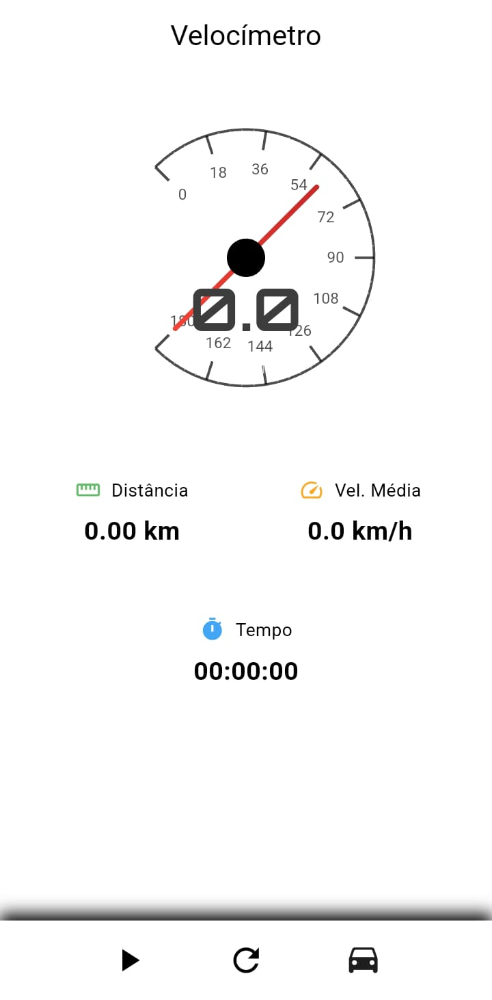
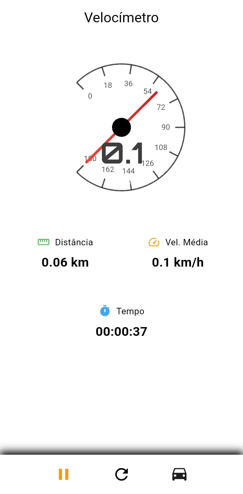
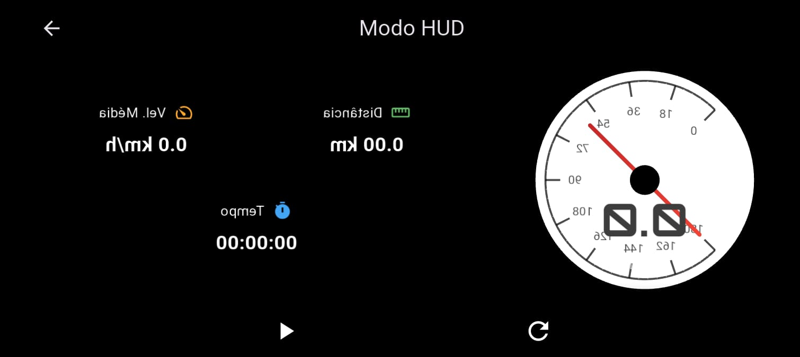
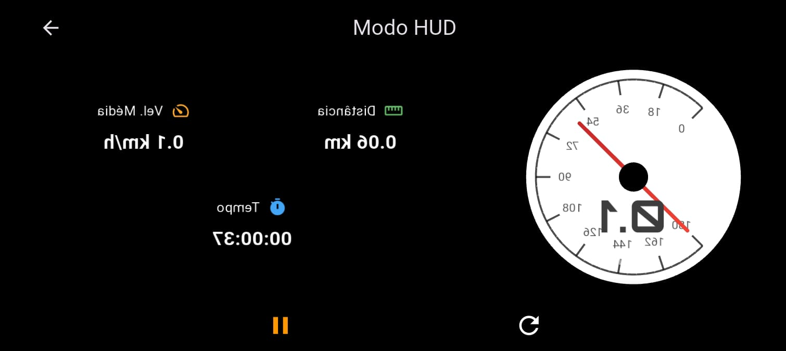

# 📱 Velocímetro & Hodômetro

O **Velocímetro & Hodômetro** é um aplicativo em Flutter que permite acompanhar em tempo real a **velocidade atual** e a **distância percorrida** durante uma viagem.  
O app foi pensado para motoristas, ciclistas e até para caminhadas, fornecendo informações de forma simples e clara.

---
## 🏹 Versões:

```
• Flutter 3.35.3 Framework
• Dart 3.9.2
```git a

---

## 🚀 Como o aplicativo funciona

### 1. Tela inicial
Ao abrir o aplicativo, você será direcionado para a **tela principal**:
- Mostra a **velocidade atual** do dispositivo em km/h (obtida via GPS).
- Mostra o **hodômetro**, ou seja, a distância total percorrida desde o início da medição.
- A interface está em **modo retrato** (não gira com o celular), para melhor legibilidade.

### 2. Localização em tempo real
- O app utiliza o GPS do dispositivo para calcular a velocidade e a distância.
- É necessário **permitir acesso à localização** ao abrir o app pela primeira vez.
- O cálculo da velocidade é feito a cada atualização de posição do GPS.

### 3. Contagem da distância (Hodômetro)
- O hodômetro soma a distância percorrida a cada atualização do GPS.
- Se você iniciar uma caminhada, corrida ou viagem de carro, a distância vai aumentar em tempo real.

### 4. Interface
- **Design escuro** para não incomodar a visão durante a condução.
- **Barra de status transparente** para aproveitar melhor a tela.
- Os elementos principais (velocidade e hodômetro) ficam em destaque.

### 4. Modo Hud
- **Design escuro** para não incomodar a visão durante a condução.
- Os elementos principais (velocidade e hodômetro) ficam invertidos para espelhar no vidro do carro e o motosita ter uma melhor experiência.

---

## 🛠️ Requisitos para uso
- Conceder permissão de **localização** ao aplicativo.
- Manter o **GPS do dispositivo ativado**.
- Conexão com satélites GPS (Precisa do GPS habilitado).

---

## 📊 Exemplo de uso
1. Abra o app.
2. Dê permissão de localização.
3. Comece a andar, correr ou dirigir.
4. Na tela, você verá:
   - Sua **velocidade atual (km/h)**.
   - A **distância percorrida (em km ou metros)** desde que abriu o app.
   ## 📸 Capturas de Tela


<br/>
<br/>
<br/>

<br/>
<br/>
<br/>

<br/>
<br/>
<br/>



---

## 📌 Observações
- A precisão da velocidade depende da qualidade do sinal do **GPS**.
- Em locais fechados ou com muitos prédios altos, os valores podem oscilar.
- O aplicativo **não substitui** velocímetros oficiais de veículos, serve apenas como apoio.

---

## 👨‍💻 Autor
Desenvolvido como prática de **Flutter + MVVM + Provider**, com foco em integração de GPS para medição de velocidade e distância em tempo real.
Autores: Gabriela, Maria Caroline e Maximiliano 

## 📌 Orientação sobre como contribuir com o projeto
1. Faça um fork deste repositório.
2. Crie uma branch para sua modificação: 
3. Realize as alterações desejadas e faça commit:  
```
git commit -m "Descrição clara da alteração"
```
4. Envie as alterações para o seu fork:  

```
git push origin minha-contribuicao
```
**⚠️ Importante: mantenha o código limpo, documentado e seguindo os padrões definidos no projeto.**